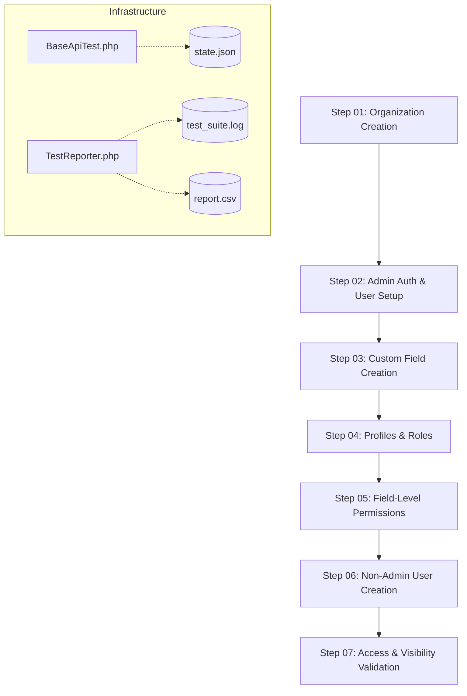

# Phase 1: Test Execution Flow

This directory contains the first phase of automated API tests. The tests are designed to run **sequentially**, as each step depends on the data (IDs, tokens, configurations) created in the previous step.

## 🗺️ Flow Map



## 📝 Step Details

### [Step 01: Organization Creation](Step01_OrganizationTest.php)
- Creates a new tenant organization.
- Validates field requirements and duplicate name handling.
- **Output:** Saves `organization_id` to persistent state.

### [Step 02: Admin Auth & User Setup](Step02_AdminAuthTest.php)
- Creates the initial root administrator for the organization.
- Performs login to acquire a JWT Bearer token.
- **Output:** Saves `admin_email`, `admin_password`, and `token` to state.

### [Step 03: Custom Field Creation](Step03_FieldCreationTest.php)
- Adds dynamic fields (Text, Number, Date) to **Lead** and **Contact** modules.
- **Output:** Saves custom field IDs for permission mapping.

### [Step 04: Profiles & Roles](Step04_ProfileRoleTest.php)
- Establishes the organizational hierarchy.
- Creates Profiles (e.g., Sales Manager, Sales Executive).
- Creates Roles (e.g., CEO -> Manager).
- **Output:** Saves profile and role IDs.

### [Step 05: Field-Level Permissions](Step05_FieldPermissionTest.php)
- Configures what each Profile can see or edit.
- Example: Lead Score is visible to Managers but hidden from Executives.
- **Output:** Updates system configuration via API.

### [Step 06: Non-Admin User Creation](Step06_UserCreationTest.php)
- Creates real users assigned to the previously created roles/profiles.
- **Output:** Saves non-admin credentials for testing.

### [Step 07: Access & Visibility Validation](Step07_NonAdminAccessTest.php)
- Logs in as non-admin users.
- Verifies that field-level permissions are strictly enforced by the backend API.
- **Output:** Final validation of the Phase 1 security model.

---

## 🚀 How to Run

Run the entire flow with a single command:
```bash
# Via PHP Artisan
docker exec atompen-app php artisan test tests/ApiTests/Phase1

# Via PowerShell Runner
.\run-all-tests.ps1
```
